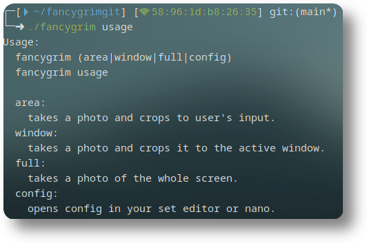

# fancygrim
a small bash script that I use for screenshotting. (hyprland only)  
i made this because I was infuriated with the lack of good screenshotting tools. This tool takes a screenshot and THEN resizes it, instead of taking a resizing and taking a screenshot of slurp. It also allows you to toggle a shadow and change the border radius for each individual mode.


  
## features:
- area, window & full screenshots
- shadows & corner rounding
    - shadows can be toggled
    - border radius can be configured.
- full config
    - configure with `fancygrim config`
    - configuration is within the script.
    - might be moved soon, if i feel like it
- notification w/ preview

## config defaults
```bash
AREA_SHADOW=true # toggle shadow for "area" screenshots
AREA_CORNER_INTENSITY=15 # border radius for "area" screenshots, 0 for disable
WINDOW_SHADOW=true # toggle shadow for "window" screenshots
WINDOW_CORNER_INTENSITY=15 # border radius for "window" screenshots, 0 for disable
FULL_SHADOW=false # toggle shadow for "full" screenshots
FULL_CORNER_INTENSITY=0 # border radius for "full" screenshots, 0 for disable
SEND_NOTIF=true # toggle notification, useful for people without a notification daemon.
NOTIF_IMAGE=true # toggle image in notification
COPY_TO_CLIPBOARD=true # toggle whether /tmp/fancygrimss.png should be saved to the clipboard.
PASTE_ONCE=false # toggle whether paste once or not
```

## dependencies:
- grim
- slurp
- imagemagik
- jq
- hyprpicker
- hyprctl
- wl-clipboard
- bash
  
Arch Example: 
```
sudo pacman -S grim slurp imagemagik jq wl-clipboard && yay -S hyprpicker
```
(hyprpicker is in the AUR, bash is needed to run the command, hyprctl comes with hyprland ootb)

# installation:
```
git clone https://github.com/memyboi/fancygrim && bash ./fancygrim/installation.sh
```
(installation.sh found at the root of this repo, check if you don't trust this.)
