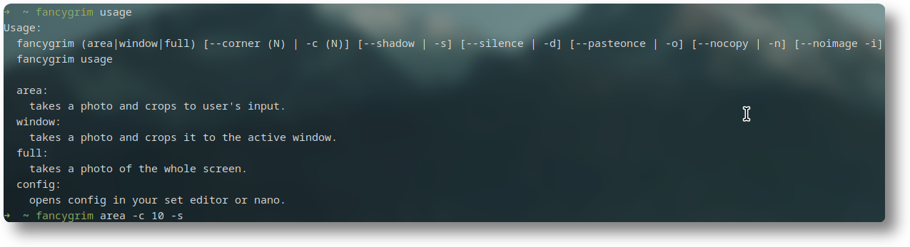
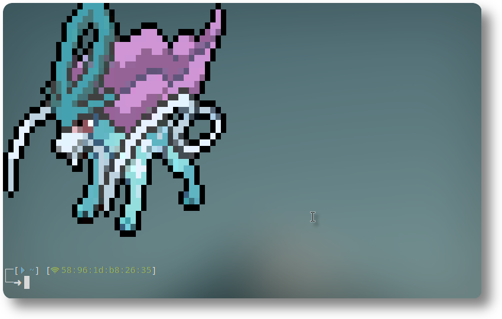

# fancygrim
a small bash script that I use for screenshotting. (hyprland only)  
i made this because I was infuriated with the lack of good screenshotting tools. This tool takes a screenshot and THEN resizes it, instead of taking a resizing and taking a screenshot of slurp. It also allows you to toggle a shadow and change the border radius for each individual mode. It makes it a *little* slower, but tbh i don't care all too much.

> [!IMPORTANT]
> This was made for Hyprland/Wayland in mind.  
> This will very likely not work on X11.  
> It uses hyprpicker to freeze the screen, which means it may not work for other wayland compositors.
> Please let me know if it does work outside of Hyprland.
  
area screenshot:  
  
window screenshot:  
  
  
## features:
- area, window & full screenshots
- shadows & corner rounding
    - shadows can be toggled
    - border radius can be configured.
- a small range of options
    - explained in `fancygrim usage`
- notification w/ preview

## defaults (with no options)
```bash
Shadows=false
CornerIntensity=10
Notification=true
Pre-Notification=true
CopyImage=true
PasteOnce=false
NotificationImage=true
```

## dependencies:
- grim
- slurp
- imagemagik
- jq
- hyprpicker
- hyprctl
- wl-clipboard
- bash
- sudo (for the installer)
- wget (for the installer)
  
Arch Example: 
```
sudo pacman -S grim slurp imagemagik jq wl-clipboard && yay -S hyprpicker
```
(hyprpicker is in the AUR, bash is needed to run the command, hyprctl comes with hyprland ootb)

# installation:
## release version (stable, recommended)
```
git clone https://github.com/memyboi/fancygrim && bash ./fancygrim/installation.sh stable
```
  
## git version (unstable, unrecommended)
### WARNING - MAY BE UNSTABLE. ONLY FOR TESTING.
```
git clone https://github.com/memyboi/fancygrim && bash ./fancygrim/installation.sh git
```
(installation.sh found at the root of this repo, check if you don't trust this.)
